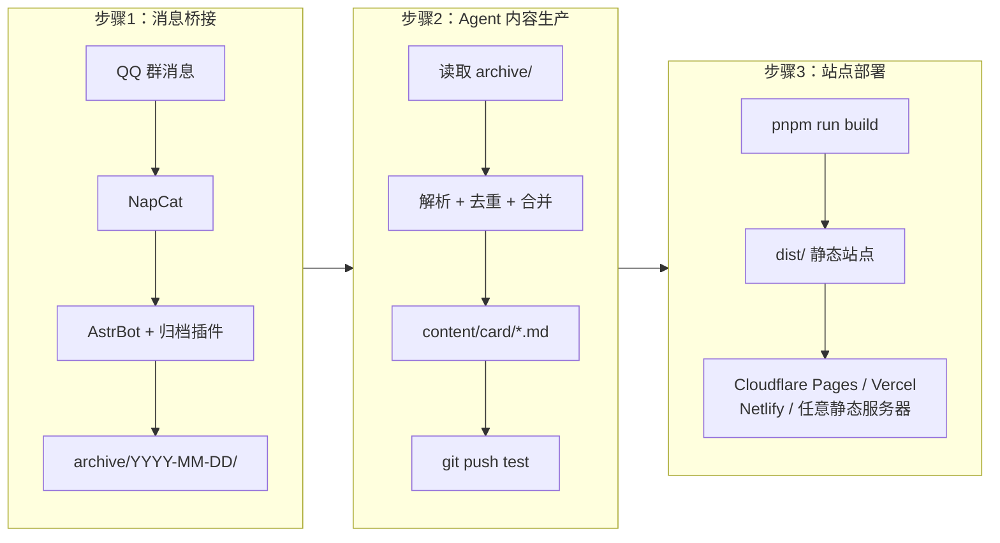

网站 UI 设计基于 @Sallyn0225 的 [gemini-rss-app](https://github.com/Sallyn0225/gemini-rss-app)，谢谢佬的无私开源！

# EDU-PUBLISH

EDU-PUBLISH 是一个依赖 AstrBot 插件 [astrbot-QQtoLocal](https://github.com/guiguisocute/astrbot-QQtoLocal) 以及各类 Agent（Claude Code、OpenClaw、Hermes）自动分析整理的**通用高校通知聚合站模板**。致力于解放高校班委的转发压力，以及打破学院之间的信息差。

---

## 部署与使用
参考本项目的文档站：[点击这里](https://doc.edu-publish.site)
（建设中）

## 整体架构

## License

[MIT](./LICENSE)
